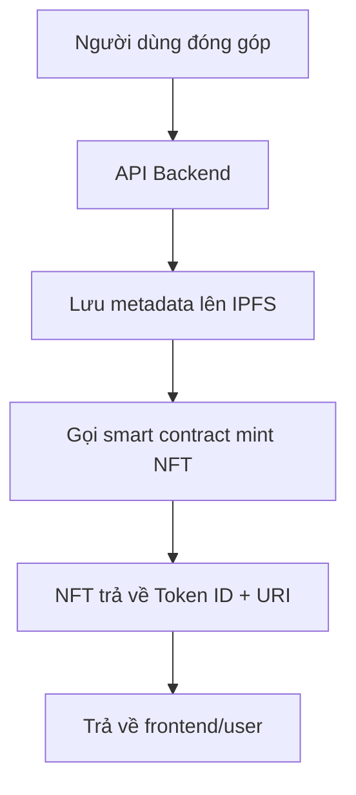

---

# 🧾 **Dự án: NFT Chứng Nhận Đóng Góp Cho Launchpad**

## 🧠 Mục tiêu dự án

Hệ thống này tạo ra **NFT chứng nhận đóng góp** cho các nhà tài trợ dự án gọi vốn cộng đồng (launchpad). Mỗi lần một người dùng quyên góp vào một dự án, họ sẽ nhận được một NFT duy nhất, lưu trữ metadata trên IPFS, xác thực bằng blockchain. NFT này đóng vai trò như một **chứng chỉ minh bạch, phi tập trung, và không thể sửa đổi**.

---

## 📌 Lợi ích chính

* ✅ **Minh bạch**: Mỗi NFT lưu vết giao dịch và thông tin dự án cụ thể.
* ✅ **Xác thực danh tiếng**: Dễ dàng chứng minh mình là người ủng hộ một dự án cụ thể.
* ✅ **Tương thích Web3**: NFT có thể được hiển thị trên ví, marketplace, hoặc làm điều kiện tham gia governance/phân phối token.
* ✅ **Lưu trữ bền vững**: Metadata được lưu trên IPFS – không phụ thuộc server tập trung.

---

## 🔧 Công nghệ sử dụng

| Thành phần                  | Mô tả                                                                |
| --------------------------- | -------------------------------------------------------------------- |
| **Smart Contract**          | Hợp đồng ERC-721 được triển khai trên Ethereum-compatible blockchain |
| **IPFS**                    | Lưu trữ metadata phi tập trung cho từng NFT                          |
| **Backend (Go)**            | API trung gian xử lý tạo, truy vấn, và quản lý NFT                   |
| **PostgreSQL** *(optional)* | Lưu index/token mapping nếu cần cache                                |
| **Frontend (tùy chọn)**     | Giao diện hiển thị NFT cá nhân, dự án đang gọi vốn                   |

---

## 🔗 Luồng hoạt động



---

## 📂 Metadata mẫu trên IPFS

```json
{
  "name": "Launchpad Donor Badge",
  "description": "You have donated to a project on our Launchpad",
  "data": {
    "walletAddress": "0x1234abcd...",
    "projectId": "abc123",
    "projectName": "Green Energy DAO",
    "donationAmount": 100000,
    "projectOwner": "0x5678def...",
    "note": "Thank you for supporting sustainable energy!"
  }
}
```

---

## 📣 Use-case gợi ý mở rộng

* 🎖 Hệ thống **xếp hạng người đóng góp tích cực** thông qua số lượng NFT.
* 🎁 **Airdrop token** hoặc đặc quyền cho người nắm giữ NFT.
* 🗳 **Governance**: Chỉ người có NFT mới được vote cho các quyết sách của dự án.
* 🔁 **Secondary market**: NFT có thể giao dịch như danh hiệu collectible.

---

## 🧪 Hướng triển khai tiếp theo

* [ ] Đồng bộ hóa ví để hiển thị NFT trong frontend.
* [ ] Tích hợp ENS hoặc Lens để thêm yếu tố định danh.
* [ ] Thêm batch mint cho các đợt donation lớn.
* [ ] Triển khai trên mạng L2 để tiết kiệm phí gas.

---

Nếu bạn cần, mình có thể hỗ trợ viết thêm phần **README.md**, **Kiến trúc triển khai**, hoặc **slide pitch** cho stakeholder. Bạn muốn làm gì tiếp theo?
